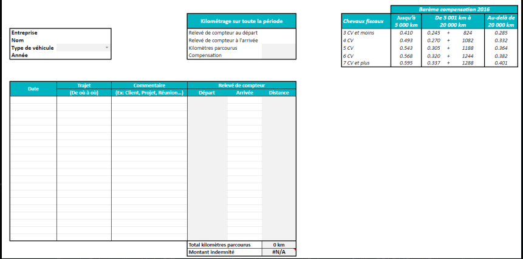

*** Code Markdown ***
*********************
# Dictionnaire des données  

## cadre 1 

| Nom       |     type     |   précision |
| ----------|----------| ---------  |
|Entreprise | text         | nom entreprise| 
|Nom        | text         | à voire     |
|type véhi. | liste        | abs         | 
|Année      | chiffre      |  JJ/MM/DD   |

## cadre 2 

| Nom                     |      type    |   précision |
| ------------------------|----------| ---------  |
|km sur toute la période  | text         | titre       | 
|relevé compt. au départ  | text         | titre face chiffre|
|relevé compt. arrivé     | text         | titre face chiffre| 
|kilometrage parcourus    | chiffre      | titre face chiffre|

## cadre 3 

| Nom                     |      type    |   précision            |
| ------------------------|---------- | -------------------- |
|barème compensation 2016 | text         | titre  de tableau      | 
|chevaux fiscaux          | text         | titre  de tableau      |
|jusqu' à 5000 km         | text         | titre de tableau       | 
|de 5001 km à 20 000km    | text         |  titre  de tableau     |
|au delà de 20 000km      | text         | titre de tableau       |
| 3 CV et moins           | text         |                        |
|0.419                    | float        | indéfini               |
|0.245 + 824              | float        | indéfini               |
|0.285                    | float        | indéfini               |

## tableau principale  
| Nom                     |      type    |   précision          |
| ------------------------|--------------| -------------------- |
|Date                     | text         | titre                |
|trajaet (de où à où )    | text         | titre                |
| commentaire ( ex: Client...) | text     | titre               |
|Relevé de compteur | ext | titre |
|Départ |text | titre|
|Arrivée | text | titre|
|Distance | text | titre |
| total km parcourus | text | label | 
|0 km | chiffre | précise le nombre km parcourus | 
|montant indemnisé | text | label| 
|#N/A | chiffre | montant d'indemnisation |

